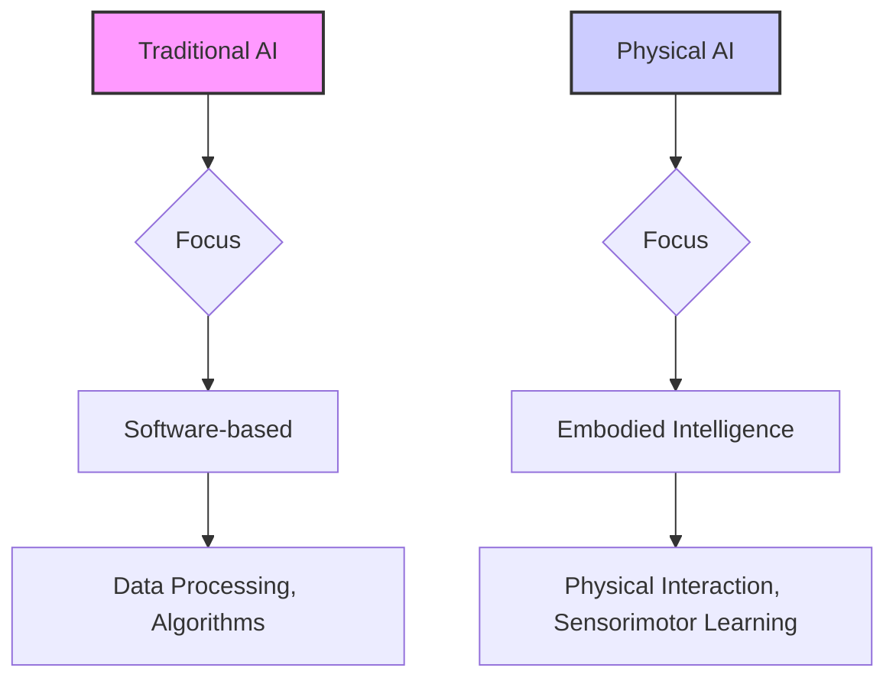

# Module 1: Introduction to Physical AI

## Week 1: Foundations of Physical AI and Embodied Intelligence

### Learning Objectives:
- Understand the core concepts of Physical AI and its distinction from traditional AI.
- Explore the principles of embodied intelligence and its importance in robotics.
- Identify key historical milestones and current trends in Physical AI.

### Content:

- Definition and scope of Physical AI.
- The Embodiment Hypothesis: how physical form influences intelligence.
- Historical overview: cybernetics, AI winter, modern resurgence.
- Current applications and future prospects of embodied AI.

### Quizzes and Assessments

To test your understanding of this week's concepts, please complete the following external quizzes:
- [Quiz on Physical AI Foundations](https://example.com/quiz-week1-foundations)
- [Assessment on Embodied Intelligence](https://example.com/assessment-week1-embodied-intelligence)
